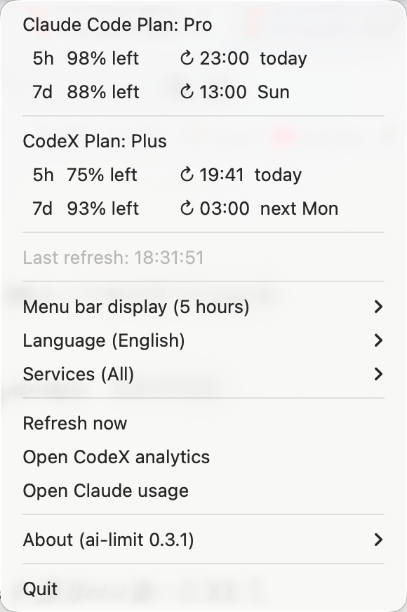
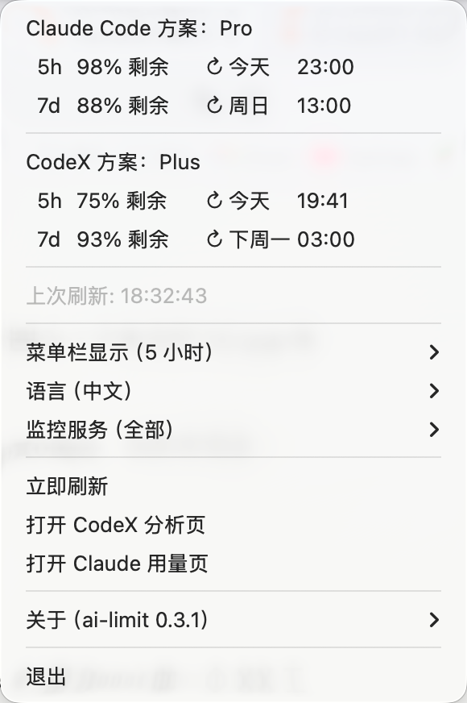
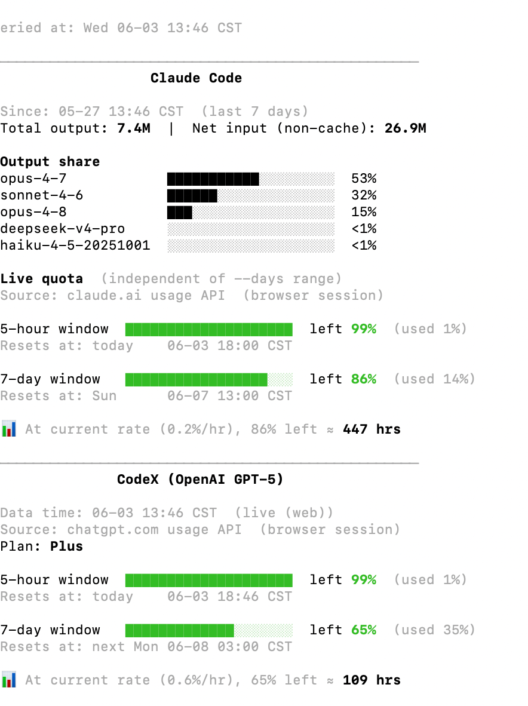
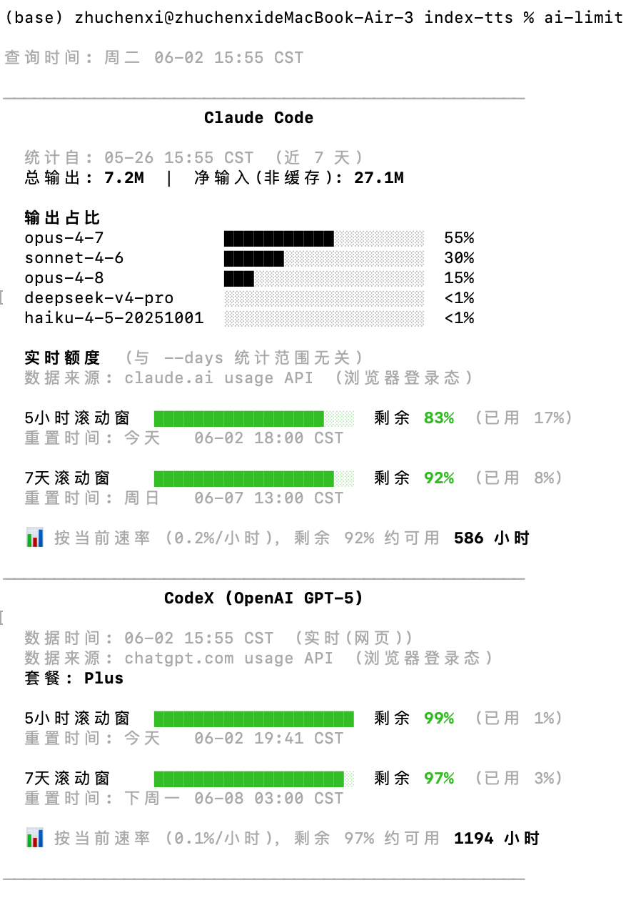

# ai-limit

[English](README.md) | 中文说明

查看 Claude Code 和 CodeX 的实时剩余额度与 token 消耗情况。支持 macOS 菜单栏 App 和命令行两种使用方式。

如果觉得有用，欢迎给个 Star 鼓励作者：[GitHub](https://github.com/zhuchenxi113/ai-limit) · [Gitee](https://gitee.com/zhuchenxi113/ai-limit)

## macOS 菜单栏 App

常驻菜单栏，实时显示剩余额度，无需打开终端。由于直接在菜单栏显示文字数据，占用空间较大，建议配合 Bartender 等工具整理菜单栏。


<table><tr>
  <td></td>
  <td></td>
</tr></table>

**一键安装**

```bash
curl -fsSL https://raw.githubusercontent.com/zhuchenxi113/ai-limit/main/install.sh | bash
```

首次启动：右键点击 App → 打开 → 仍要打开（绕过 Gatekeeper，App 尚未公证）

**功能**

- 中英文切换
- 5小时 / 7天 窗口切换
- Claude 和 CodeX 额度同时显示，可单独切换
- 手动刷新
- 点击展开详细数据（套餐、用量、重置时间）

**从源码构建**

```bash
cd menubar
/opt/homebrew/bin/python3.13 setup.py py2app
bash make-dmg.sh
```

> 必须使用 Homebrew Python，不能用 Anaconda Python（dylib 路径冲突导致 App 无法运行）。

---

## 命令行

输出语言根据系统语言自动切换，无需手动设置。

### 效果





### 环境要求

- macOS
- Python 3.8+
- Chrome 或 Firefox 已登录 [claude.ai](https://claude.ai)（用于读取 Claude 额度）
- Chrome 或 Firefox 已登录 [chatgpt.com](https://chatgpt.com)（用于读取 CodeX 额度，推荐路径）
- 可选：[CodeX CLI](https://developers.openai.com/codex/cli) 已安装并登录（作为浏览器 cookie 失效时的兜底路径）

### 使用前提

ai-limit 只读取你本机已有的 Claude / ChatGPT 登录态与本地使用记录，不提供订阅，也不会绕过任何额度限制。

- 已开通并登录 Claude Code：显示 Claude Code 额度。
- 已开通并登录 ChatGPT / CodeX：显示 CodeX 额度。
- 未开通或未登录的服务会显示 ⚠️ 提示，可在菜单栏 App 的「监控服务」里关闭对应显示。
- 如果两个服务都不可用，菜单栏会显示 `ai-limit ⚠️` 或对应错误提示。

### 安装

**1. 克隆项目**

```bash
git clone https://gitee.com/zhuchenxi113/ai-limit.git ~/Developer/ai-limit
```

**2. 安装依赖**

```bash
pip install -r requirements.txt
```

**3. 配置 alias**

在 `~/.zshrc` 中添加：

```bash
alias ai-limit="python3 ~/Developer/ai-limit/usage.py"
```

然后执行：

```bash
source ~/.zshrc
```

### 用法

```bash
ai-limit              # 最近 7 天（默认）
ai-limit --days 1     # 今天
ai-limit --all        # 全部历史
ai-limit --detail     # 展示每个模型的详细 token 统计
```

输出语言自动识别系统 locale（中文系统输出中文，其他系统输出英文）。可用 `AI_LIMIT_LANG` 环境变量手动指定：

```bash
AI_LIMIT_LANG=en ai-limit   # 强制英文
AI_LIMIT_LANG=zh ai-limit   # 强制中文
```

---

## 数据来源

### Claude Code

| 数据 | 来源 |
|------|------|
| token 消耗明细 | `~/.claude/projects/**/*.jsonl` |
| 实时剩余额度 | 浏览器 Cookie → `claude.ai/api/organizations/{orgId}/usage` |

额度获取依赖 Chrome/Firefox 的 claude.ai 登录态。Cookie 失效时自动回退，显示失败原因和网页链接。

### CodeX

数据源按优先级依次尝试：

| 优先级 | 数据 | 来源 | 是否触发 5h 窗口 |
|------|------|------|------|
| 1 | 实时剩余额度 | 浏览器 Cookie → `chatgpt.com/backend-api/codex/usage` | ❌ 不触发 |
| 2 | 实时剩余额度 | `codex app-server` WebSocket → `account/rateLimits/read` | ⚠️ **会触发** |
| 3 | 本地回退 | `~/.codex/sessions/**/*.jsonl` | ❌ 不触发 |

浏览器路径（路径 1）复用 chatgpt.com 网页分析端点，与 dashboard 同一通道，覆盖 **Cloud + CLI 合并用量**，只读不触发窗口。这是默认推荐路径。

> **⚠️ 副作用警告（CodeX 协议限制）：** 当路径 1 失败（未登录 chatgpt.com / cookie 过期 / 网络异常），ai-limit 会自动 fallback 到 `codex app-server`。这条路径需要发送 `initialize` 调用，OpenAI 会将其计为一次会话开始——若当前 5 小时窗口已到期，**会触发新的 5 小时冷却窗口计时**。这是 CodeX CLI 数据接口的固有机制，工具层面无法规避。

## 说明

- 浏览器 Cookie 读取仅支持 macOS（依赖系统 Keychain 解密 Chrome Cookie）
- Claude 额度使用的是 claude.ai 内部接口，**非官方 API**，可能随版本变化失效
- `<synthetic>` 模型记录是 Claude Code 遇到 API 错误时写入的占位，不计入统计
- 各模型输出占比仅 Claude Code 提供；CodeX 不区分模型，无此数据

## 维护说明

个人工具，按自己的使用需求维护，不保证及时处理 issue 或 PR，也不承诺长期支持。

## 作者其他项目

- [CalcPro — 计算器](https://apps.apple.com/us/app/calcpro-calculator-waitsugar/id6759244291)：可在 App Store 下载；如果链接无法直接打开，请在 App Store 搜索 “WaitSugar CalcPro”。
- [观点会审](https://decide.waitsugar.com/)：网页版决策辅助工具。

## License

本项目代码使用 [Apache License 2.0](LICENSE)。

第三方依赖：`browser-cookie3` 使用 LGPL 协议。
